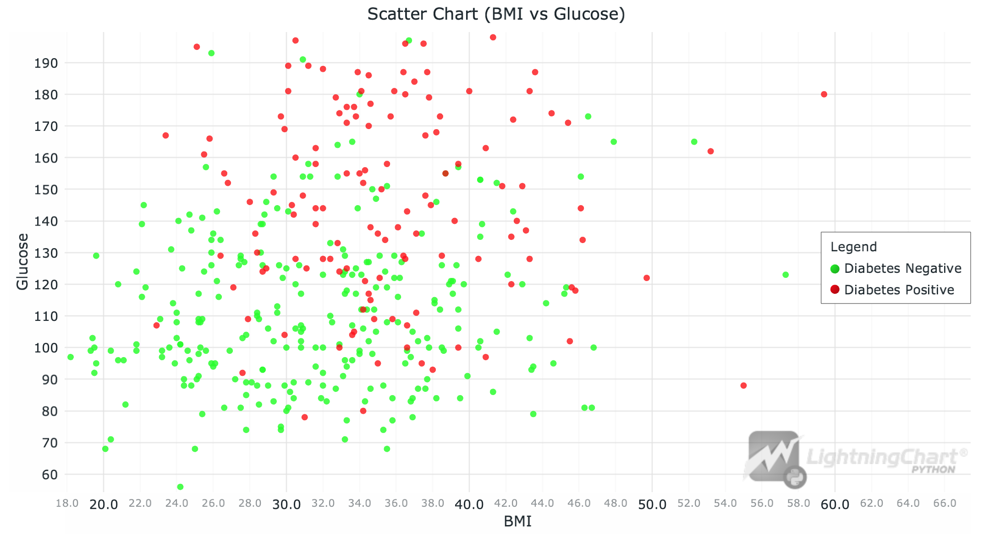
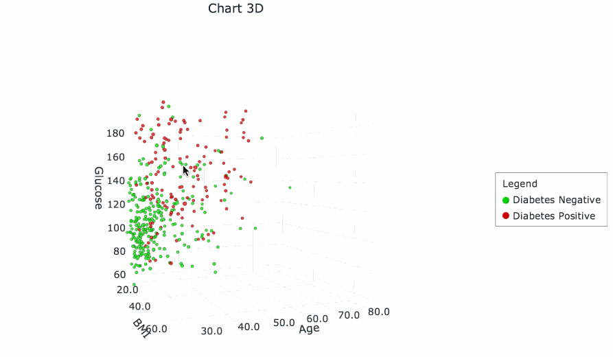
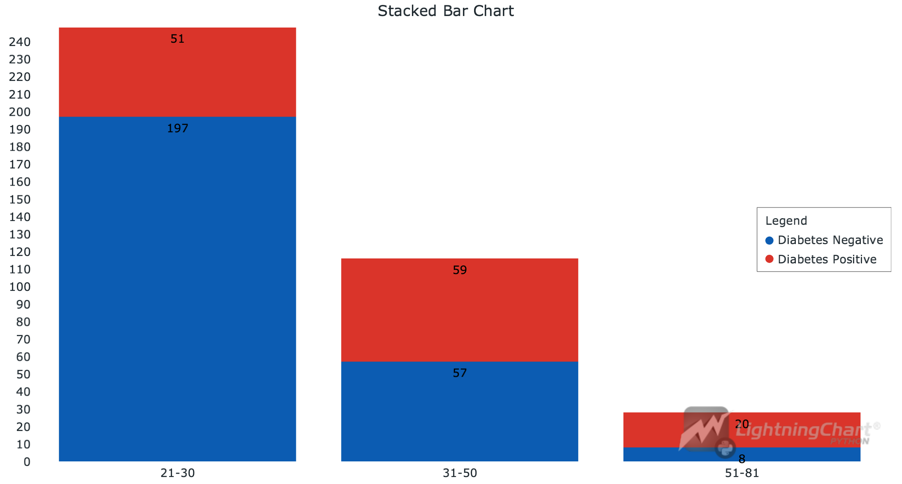
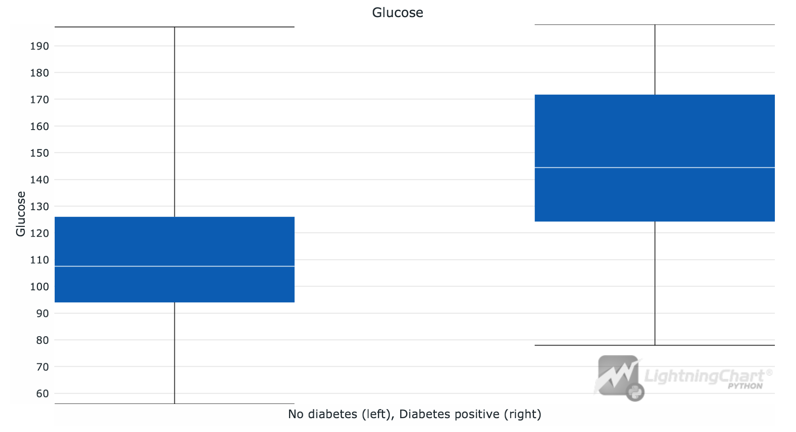
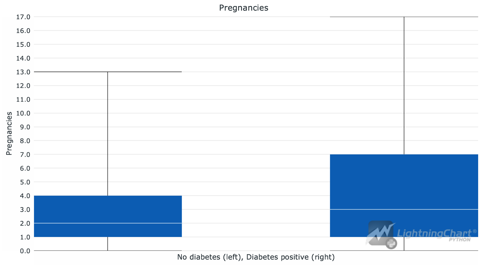

# Chronic disease dashboard with LightningChart Python
## Introduction
**Predictive analytics** nowadays play a huge role in healthcare system. In US, nearly 90% of resources spent on healthcare goes on managing chronic diseases, including diabetes.

Thus, it is an important topic to consider when working on medical data.

### Datasets
There are numerous datasets, which you can find at different healthcare institution portals (e.g. [data.gov](https://catalog.data.gov/dataset?tags=diabetes)) or dataset-related sites (e.g. [kaggle.com](https://www.kaggle.com/datasets/mathchi/diabetes-data-set)).

In this project we will review the Diabetes dataset from Kaggle and perform some basic analysis with different types of visualization. We will try to perform some chronic disease prediction.

## LightningChart Python
For this task we may use [LightningChart](https://lightningchart.com/python-charts/) library. It provides a wide range of tools for creating graphs that can be useful for flow cytometry white cell analysis in Python. \
In this project, we will use:
1. - XY Chart ([Link to docs](https://lightningchart.com/python-charts/docs/charts/chart-xy/)) \
   *in combination with*
   - Point Series ([Link to docs](https://lightningchart.com/python-charts/docs/charts/chart-xy/#point-series))

2. 3D Chart ([Link to docs](https://lightningchart.com/python-charts/docs/charts/chart-3d/)), also with Point Series
3. Stacked Bar Chart ([Link to docs](https://lightningchart.com/python-charts/docs/charts/bar-chart/#stacked-bar-chart))
4. Box Plots ([Link to docs](https://lightningchart.com/python-charts/docs/charts/box-plot/))

LightningChart provides easily-to-initialize charts that are also easily and widely customizable, so we will use this library for the visualizations.
## Setting Up Python Environment
For chronic disease visualization in Python, first we need to set up our Python environment. 
### Installation of Python on Mac
I recommend using [Homebrew package manager](https://brew.sh/) as it is popular and has a lot of packages.\
Moreover, it is arguably more convenient than installing Python using .dmg.

#### 1. First step is installing Homebrew itself
> You can skip this step if it is already installed on your Mac

Enter Terminal app and copy/paste this string
```sh
/bin/bash -c "$(curl -fsSL https://raw.githubusercontent.com/Homebrew/install/HEAD/install.sh)"
```
:exclamation: **Important note:** 
  Installation of Homebrew can be not fast, usually from 5 to 15 minutes.

#### 2. Installation of Python
```sh
brew install python
```
This command will install the latest stable version of python.


<details>
  <summary><b>If you don't want to use Homebrew</b></summary>
  You can access the <a href = 'https://www.python.org/downloads/macos/'>official Python website</a>, select the      latest stable version downloader for MacOS (it is named macOS 64-bit universal2 installer) and follow the installation instructions.
</details>

You can check the version using `python3 –version` in Terminal.
> If it displays `Unknown command` error, it is most likely due to PATH variables. Refer to  
[this guide](https://www.mygreatlearning.com/blog/add-python-to-path/) to fix.

---
### Installation of Python on Windows
I recommend using cli tool [Winget](https://learn.microsoft.com/en-us/windows/package-manager/winget/). 

#### Install Python package
Open cmd or PowerShell as Administrator and type in:
```powershell
winget install Python.Python.3
```

<details>
  <summary><b>If you don't want to use Winget</b></summary>
  You can access the <a href = 'https://www.python.org/downloads/macos/'>official Python website</a>, select the      latest stable version downloader for Windows <br> (it is named Windows installer (64-bit)) and follow the installation instructions.
</details>

You can verify installation of python and pip by typing `python --version` and `pip --version` respectively. 
> If it displays `'command' is not recognized` error, it is most likely due to PATH variables. Refer to [this guide](https://www.mygreatlearning.com/blog/add-python-to-path/) to fix.

---

### Installation of IDE
For IDE (integrated development environment) I recommend using [PyCharm](https://www.jetbrains.com/pycharm/download/?section=mac) as it is clean and powerful. However, full version is paid so you can also use [VSCode](https://code.visualstudio.com/).

:exclamation: **Important:**
In this project it is better to use either Pycharm **Professional** or VSCode.

(*Optional*) You may want to set up `venv` (Python virtual environment) so you can install packages there and not clutter the Python installation.
Environment creating instructions:
- PyCharm - https://www.jetbrains.com/help/pycharm/creating-virtual-environment.html#python_create_virtual_env
- VSCode - https://code.visualstudio.com/docs/python/environments

---

### Setting up jupyter notebook

#### For PyCharm (ONLY PROFESSIONAL VERSION):
Just create an .ipynb file and start coding. The IDE will install everything needed on its own.


#### For Visual Studio Code
1. Install Jupyter extension 
2. Select and open the working directory
3. Create venv (`⇧⌘P` or `Ctrl-⇧-P`). Very recommended!
4. Refer to the article (starting from "Workspace Trust" paragraph): [click](https://code.visualstudio.com/docs/datascience/jupyter-notebooks#_workspace-trust)

---

### Libraries Used
#### Jupyter
A very nice library for data analysis, supports both executable code blocks and markdown blocks. 
With it, you can create clear and visual analysis reports.

#### Pandas
In this project, we will mainly use the dataframe, two-dimensional data structure provided by Pandas. It can be easily created from CSV or Excel file.

#### LightningChart
LightningChart is the main library used in the project for creating different types of charts in Python. It provides a highly customizable graph building tools, including simple XY charts, 3D charts, Bar charts, Spider charts, Map charts.

## Installing and importing libraries
Type in terminal to install libraries:
```sh
pip install pandas lightningchart
```

Then, when started coding, write this code to import these libraries:
```python
import pandas as pd
pd.options.mode.chained_assignment = None
import lightningchart as lc
```

---

## Handling and preprocessing data
> Note: You can see complete code inside .ipynb files, here will be the summary.

#### Reading data from `csv` file
The file with data is contained under `/data` folder.
```python
df = pd.read_csv("data/diabetes.csv")
df  # this will display the dataframe after cell
```

#### Deleting irrelevant entries
Firstly, we need to delete invalid entries where there is an error (the values are 0):
```python
df = df[(df['Glucose'] != 0) & (df['Insulin'] != 0) & (df['BMI'] != 0)]
```

#### Dividing age into bins
We need to assign each entry a relevant age bin (we will need it later):
```python
ages = df["Age"]
print("Min age: ", min(ages), "\nMax: ", max(ages))
```
```
Output:

Min age:  21 
Max:  81
```
---
```python
bins = [20, 30, 50, 81]  
labels = ['21-30', '31-50', '51-81']

df["Age_range"] = pd.cut(df["Age"], bins=bins, labels=labels, right=True)
df["Outcome_label"] = df["Outcome"].replace({0: 'Diabetes Negative', 1: 'Diabetes Positive'})

df
```
```
Output:

     Pregnancies  Glucose  BloodPressure  SkinThickness  Insulin   BMI  \
3              1       89             66             23       94  28.1   
4              0      137             40             35      168  43.1   
6              3       78             50             32       88  31.0   
8              2      197             70             45      543  30.5   
13             1      189             60             23      846  30.1   
..           ...      ...            ...            ...      ...   ...   
753            0      181             88             44      510  43.3   
755            1      128             88             39      110  36.5   
760            2       88             58             26       16  28.4   
763           10      101             76             48      180  32.9   
765            5      121             72             23      112  26.2   

     DiabetesPedigreeFunction  Age  Outcome Age_range      Outcome_label  
3                       0.167   21        0     21-30  Diabetes Negative  
4                       2.288   33        1     31-50  Diabetes Positive  
6                       0.248   26        1     21-30  Diabetes Positive  
8                       0.158   53        1     51-81  Diabetes Positive  
13                      0.398   59        1     51-81  Diabetes Positive  
..                        ...  ...      ...       ...                ...  
753                     0.222   26        1     21-30  Diabetes Positive  
755                     1.057   37        1     31-50  Diabetes Positive  
760                     0.766   22        0     21-30  Diabetes Negative  
763                     0.171   63        0     51-81  Diabetes Negative  
765                     0.245   30        0     21-30  Diabetes Negative  

[392 rows x 11 columns]
```

#### Dividing into 2 tables based on outcome
We also need to divide our dataframe into two for our convinience later:
```python
df_negative = df[df['Outcome'] == 0]
df_positive = df[df['Outcome'] == 1]
```

## Creating and customizing charts
### Scatter chart (BMI vs Glucose):

```python
glucose_negative = df_negative["Glucose"].tolist()  # get data columns from tables
BMI_negative = df_negative["BMI"].tolist()

glucose_positive = df_positive["Glucose"].tolist()
BMI_positive = df_positive["BMI"].tolist()

scatter = lc.ChartXY(   # scatter chart intialization
    theme=lc.Themes.White,  # overall theme
    title='Scatter Chart (BMI vs Glucose)', 
)
series_negative = scatter.add_point_series().add(
    x=BMI_negative,  # push samples to series
    y=glucose_negative,
)
series_positive = scatter.add_point_series().add(
    x=BMI_positive,  
    y=glucose_positive,
)

# Set colors of dots and names of the series
series_negative.set_point_color(lc.Color(0, 255, 0, 192)).set_name("Diabetes Negative")
series_positive.set_point_color(lc.Color(255, 0, 0, 192)).set_name("Diabetes Positive")

# Set titles of axis 
scatter.get_default_x_axis().set_title("BMI")
scatter.get_default_y_axis().set_title("Glucose")
scatter.add_legend().add(scatter)
scatter.open()
```
`Output:`


### Analysis:
By looking at this chart the correlation between these two characteristics and the disease is visible:

> Those with high Glucose and BMI are more likely to have diabetes. However, high glucose numbers contrubite to the diagnosis more than BMI.
> Also, those with low BMI usually have less glucose levels.

---

**Try to create a 3D chart `(x = BMI, y = Glucose, z = Age)` yourself, if you wish.** 
Use this guide: [link](https://lightningchart.com/python-charts/docs/charts/chart-3d/).
<details>
  <summary><b>SPOILER: code for 3D chart</b></summary>
  
  ```python
  age_negative = df_negative["Age"].tolist()  # ages to list
  age_positive = df_positive["Age"].tolist()
  
  scatter3d = lc.Chart3D(  # 3d chart instance
      theme=lc.Themes.White,
      title='Chart 3D',
  )
  
  series_negative = scatter3d.add_point_series(render_2d=False).add(
      x=BMI_negative,
      y=glucose_negative,
      z=age_negative
  )
  series_positive = scatter3d.add_point_series(render_2d=False).add(
      x=BMI_positive,
      y=glucose_positive,
      z=age_positive
  )
  
  series_negative.set_point_color(lc.Color(0, 255, 0, 192)).set_name("Diabetes Negative")
  series_positive.set_point_color(lc.Color(255, 0, 0, 192)).set_name("Diabetes Positive")
  
  
  scatter3d.get_default_x_axis().set_title("BMI")  
  scatter3d.get_default_y_axis().set_title("Glucose")
  scatter3d.get_default_z_axis().set_title("Age")
  scatter3d.add_legend().add(scatter3d)
  scatter3d.open()
  ```

</details>

`Output:`


### Analysis:
> Age seems not to contribute so much to the outcome, we can check it by using Bar Chart

---

### Stacked Bar Chart (Age-wise)

```python
outcome_counts = df.groupby(['Age_range', 'Outcome_label'], observed=True).size().unstack(fill_value=0).reset_index()  # ages to columns

result = []
for outcome_label in ['Diabetes Negative', 'Diabetes Positive']:  # make json-like formation of data
    values = outcome_counts[outcome_label].tolist()   
    result.append({                     
        'subCategory': outcome_label,
        'values': values
    })
    
barchart_stacked = lc.BarChart(  # initialize bar chart
    vertical=True,
    theme=lc.Themes.White,
    title='Stacked Bar Chart',
).set_value_label_display_mode('insideBar')  # count of entries is inside bar, default - outside
barchart_stacked.set_data_stacked(labels, result)  # set data
barchart_stacked.add_legend().add(barchart_stacked)  # add legend
barchart_stacked.open()
```
`Output:`


### Analysis:
> Though the age groups (31-50) and (51-81) aren't as numerical as (21-30), percentage-wise we can say that the older the person, the higher the risk of diabetes.

---

### Box plot (Glucose)
Let's look at the numbers of glucose for diabetes-negative patients and diabetes-positive.
```python
glucose_diabetes = df_positive['Glucose'].values  # divide entries by diabetes
glucose_no_diabetes = df_negative['Glucose'].values

boxplt = lc.BoxPlot(  # init bax plot
    data=[glucose_no_diabetes, glucose_diabetes],
    theme=lc.Themes.White,
    title='Glucose',
    xlabel='No diabetes (left), Diabetes positive (right)',
    ylabel='Glucose'
)
boxplt.open()
```
`Output:`


### Analysis
> This supports the tendency we saw in scatter plot: Diabetes-positive patients have higher levels of glucose.


### Another box plot (Number of pregnancies)
Let's explore the correlation between pregnancies and diabetes:

```python
pregnancies_diabetes = df_positive['Pregnancies'].values
pregnancies_no_diabetes = df_negative['Pregnancies'].values

boxplt1 = lc.BoxPlot(
    data=[pregnancies_no_diabetes, pregnancies_diabetes],
    theme=lc.Themes.White,
    title='Pregnancies',
    xlabel='No diabetes (left), Diabetes positive (right)',
    ylabel='Pregnancies'
)
boxplt1.open()
```
`Output:`


### Analysis
> Most likely diabetes depends on the number of pregnancies, but the dependence is not that strong

## Conclusion
In this guide, we did a chronic disease visualization in Python. We used Jupyter notebook along with libraries `lightningchart` and `pandas`. 
